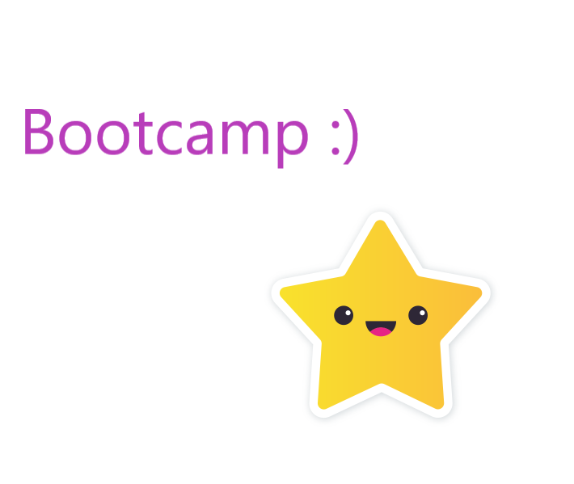

# BootCampMaDu - Heading level 1

Heading level 1
===============

## My Bootcamp repository - Heading level 2

This is Heading level 2
-----------------------


###### Here you can see, how we can add emphasis by making text **bold** and *italic*.

odio facilisis mauris sit **amet massa vitae tortor** condimentum lacinia quis vel eros donec ac odio tempor orci dapibus ultrices in iaculis nunc sed augue lacus viverra vitae congue eu consequat ac felis donec et odio pellentesque diam volutpat commodo sed egestas egestas fringilla phasellus faucibus scelerisque eleifend donec pretium vulputate sapien nec sagittis aliquam __malesuada bibendum__ arcu vitae elementum curabitur vitae nunc sed velit dignissim _sodales_ ut eu sem integer vitae justo eget magna fermentum iaculis eu non diam phasellus vestibulum lorem sed risus ultricies *tristique* nulla aliquet ***enim tortor*** at auctor urna nunc id cursus metus aliquam eleifend

###### We can create blockquotes, nested blockquotes.
> et ligula ullamcorper malesuada proin libero nunc consequat interdum varius
>
> Tut enim blandit volutpat maecenas volutpat blandit aliquam etiam erat velit scelerisque in


> et ligula ullamcorper malesuada proin libero nunc consequat interdum varius
>
>> Tut enim blandit volutpat maecenas volutpat blandit aliquam etiam erat velit scelerisque in


###### Here we can see items organized into ordered or unordered lists.

1. First flower
2. Second flower
3. Third flower
4. Fourth flower

###### two level list:
1. first line
2. second line
	1. a
	2. b
3. third line
	1. c
	2. d

###### unordered list
- First
- Second
- Third
	- a
	- b


###### We can add code as well:
```
<body onload="change()">
  <script>
  function change(){
  document.getElementById("CHANGE").innerHTML = "MY LAST POST";
  document.getElementById("a").style.color = "green";
  document.getElementById("b").style.color = "green";
  document.getElementById("c").style.color = "green";
  document.getElementById("d").style.color = "green";
  document.getElementById("e").style.color = "green";
  document.getElementById("f").style.color = "green";
  document.getElementById("g").style.color = "green";
  document.getElementById("h").style.color = "green";
  }
</script>
```

###### We can create tables, too. And we can align the text.
| Flowers   | Colors |
| :------   | :----: |
| Violet    | Purple |
| Dandelion | Yellow |

###### We can use links:
[tesena](https://www.tesena.com/)

###### And we can strikethrough the text
~~I have to finish the bootcamp.~~ 

###### We can create task lists:
- [x] Finish the bootcamp
- [ ] Report the bootcamp
- [ ] Prepare self-review

###### And of course, we can add some pictures:



